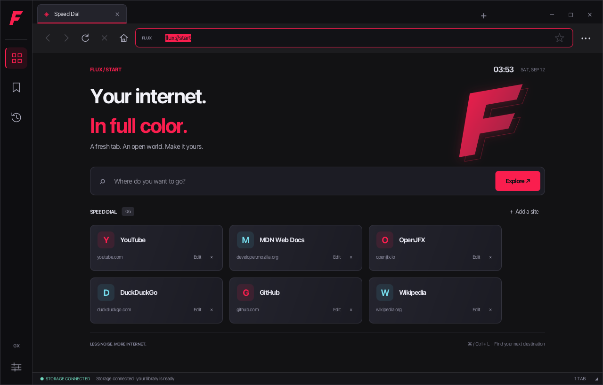

# Flux Browser

A Java 21+ desktop browser with an Opera GX-inspired carbon/magenta/cyan interface, native macOS WebKit rendering (JavaFX WebView on other platforms), and asynchronous PostgreSQL storage. The JavaFX interface and native-page viewport are defined in FXML with dedicated controllers; WebKit supplies webpage rendering and native page dialogs.



## 1. Architectural blueprint and MVP matrix

The supplied Min browser was analyzed before implementation. See [ARCHITECTURE.md](docs/ARCHITECTURE.md) for the source-grounded feature matrix, component diagram, package tree, and threading decisions.

Flux includes URL/search resolution, independent tabs, Back/Forward/Reload/Home/Stop, real loading progress, page titles, popup tabs, bookmark toggling and editing, chronological history, editable Speed Dial, accent selection, zoom, and custom window controls. The Min checkout is a reference, not a runtime dependency.

## 2. Maven dependencies

The complete [pom.xml](pom.xml) targets Java 21 and configures:

| Dependency | Version | Purpose |
| --- | --- | --- |
| `javafx-controls` | 21.0.12 | Controls, layouts, CSS, and input |
| `javafx-fxml` | 21.0.12 | FXML loading and controller injection |
| `javafx-web` | 21.0.12 | Compatibility engine on non-macOS or `-Dflux.engine=javafx` |
| `postgresql` | 42.7.13 | JDBC storage |
| `javafx-maven-plugin` | 0.0.8 | `mvn javafx:run`, including native JavaFX dependencies |

JavaFX transitively supplies its base, graphics, and media modules. Maven selects native libraries matching the running JDK's OS and architecture. The supplied `module-info.java` declares the JavaFX/JDBC requirements and opens the controller package for FXML injection. The JavaFX plugin arranges the module path, including the JavaScript bridge used on modern JDKs. No manual JavaFX SDK installation, ORM, Node, or Electron installation is required.

On JDK 24 and later, the automatically activated `modern-jdk` Maven profile selects **JavaFX 26.0.2**, including its JavaScript bridge module. JavaFX 21.0.12 remains the default for JDK 21–23. Application source still targets Java 21. This avoids relying on the JavaScript bridge that newer JDKs no longer supply; see the [JavaFX 24 module change](https://openjfx.io/highlights/24/) and [JavaFX 26 runtime requirements](https://openjfx.io/highlights/26/).

On macOS, Flux now uses **WKWebView**, the system WebKit engine, inside the JavaFX window. This replaces JavaFX WebView for everyday browsing on your M3. WebKit manages its web-content/network/GPU processes; page JavaScript and video no longer render through JavaFX's WebView pipeline. Native calls enqueue asynchronously in AppKit and JavaFX; neither path waits for page-script execution. The bridge builds automatically using **Xcode Command Line Tools** (`xcode-select --install` if missing), supports macOS 12+, and packages the library for the running JDK's architecture. Use `mvn javafx:run` as before. To open a page at launch: `mvn javafx:run -Djavafx.args="--url=https://github.com/"`. System WebKit updates come with macOS.

JavaFX uses Metal for the **shell** on macOS with JDK 24+, with ES2/software fallbacks. On older JDKs the shell uses software rendering. This setting does not control WKWebView's compositor. The earlier software-default choice came from a synthetic JavaFX WebView test; subsequent media/site tests exposed its limits and prompted the native-engine replacement. To compare the old engine explicitly: `mvn -Dflux.engine=javafx javafx:run`. See [VERIFICATION.md](docs/VERIFICATION.md) for measurements and limitations.

The default maximum Java heap is **1 GiB (`1024m`)**, leaving room on an 8 GB Mac for macOS, PostgreSQL, and other applications. This is a Java heap limit, **not a cap on total browser memory**: WebKit documents, native media, and graphics buffers also consume memory. Override it when needed with `mvn -Dflux.maxHeap=1536m javafx:run`. Use an Apple Silicon JDK on the M3 so Maven selects arm64 JavaFX libraries.

Versions were checked against the [OpenJFX release notes](https://gluonhq.com/products/javafx/openjfx-21-release-notes/) and [pgJDBC downloads](https://jdbc.postgresql.org/download/). See [OpenJFX's Maven instructions](https://openjfx.io/openjfx-docs/#maven) for platform setup.

## 3. Database layer and setup

Install a JDK 21 or later, Maven 3.9+, and a running PostgreSQL server. A desktop session is required for JavaFX. Use a JDK matching your CPU architecture. On macOS, this workspace also has JDK 21 available:

```sh
export JAVA_HOME=$(/usr/libexec/java_home -v 21)
java -version
mvn -version
```

Start your PostgreSQL installation using its normal service controls. For Homebrew PostgreSQL 18, for example:

```sh
brew services start postgresql@18
```

Connect as your PostgreSQL administrator. With Homebrew, `psql -d postgres` normally uses your local account. On installations with a `postgres` administrator, use `psql -h localhost -U postgres -d postgres`. In the psql session, run:

```sql
CREATE ROLE flux WITH LOGIN;
\password flux
CREATE DATABASE flux OWNER flux;
\q
```

The `\password` command prompts for the role's password. If the role/database already exists, use the existing credentials instead of creating it again.

From the `Flux` directory, copy the local configuration template:

```sh
cp config/database.properties.example config/database.properties
```

Edit `config/database.properties` and set the password you just chose. This local credentials file is ignored by Git. Its defaults are database `flux`, user `flux`, and port `5432`. Environment variables `FLUX_DB_URL`, `FLUX_DB_USER`, and `FLUX_DB_PASSWORD` override the corresponding file values, including an explicitly empty password. The application never displays credentials in its interface.

Flux initializes its tables on a background thread at startup. To inspect or apply the exact same standalone schema manually:

```sh
psql -h localhost -U flux -d flux --single-transaction -v ON_ERROR_STOP=1 -f database/schema.sql
```

[schema.sql](database/schema.sql) creates `history`, `bookmarks`, and `speed_dial`, with identity IDs, timestamp indexes, timezone-aware dates, unique saved URLs, bookmark folders, and initial Speed Dial sites. The brief's `quick_dial` and `speed_dial` names represent the same feature; this implementation uses **`speed_dial`**. Seeds are inserted only when creating the table, so deleting a starter tile is permanent.

[DatabaseManager.java](src/main/java/com/flux/browser/db/DatabaseManager.java) owns the connection factory, schema transaction, timeouts, **two JDBC readers and one ordered writer**. The reader and writer executors each have a 64-task queue; idle threads retire after 30 seconds. Queue saturation fails the operation through its future instead of running SQL on JavaFX or growing memory without a bound. [HistoryDAO.java](src/main/java/com/flux/browser/db/HistoryDAO.java), [BookmarkDAO.java](src/main/java/com/flux/browser/db/BookmarkDAO.java), and [SpeedDialDAO.java](src/main/java/com/flux/browser/db/SpeedDialDAO.java) expose asynchronous prepared-statement operations. Connections, statements, and result iteration stay off the JavaFX thread; controllers apply results with `Platform.runLater`.

Reads can run alongside writes and see the last committed database state. Controllers refresh saved data after the write future completes; calling a read immediately after submitting a write does not itself guarantee that write has committed. Writes retain submission order, including a history clear behind already accepted visits. Each operation owns and closes its connection.

History stores successful HTTP(S) loads, including reload and Back/Forward visits. Home, tab switching, failed/cancelled loads, and title-only changes do not add visits. Clearing history preserves bookmarks and shortcuts. Library searches show up to 500 matching records; narrow the search to find older entries. Title and URL lengths are bounded to match the database schema.

If PostgreSQL is unavailable, Flux still opens and browses. The footer reports **STORAGE OFFLINE**, starter tiles remain available, and saving actions are unavailable or report failure. These starter tiles are not presented as saved data. After fixing the connection, use **Settings → Reconnect storage**. Failed visits are not queued for later replay.

## 4. FXML and GX theme

The complete UI lives in [src/main/resources/com/flux/browser/view](src/main/resources/com/flux/browser/view), with the shared [style.css](src/main/resources/com/flux/browser/style.css). The UI uses the specified carbon palette with magenta/cyan accents, SVGPath artwork, a thin sidebar, custom tab chips, and native FXML home/library/settings screens.

The extensive [Scene Builder guide](docs/UI_SCENEBUILDER_GUIDE.md) documents all 13 FXML/controller pairs, injected fields, action handlers, runtime bindings, and safe live-demo edits. Dynamic rows and tiles also have standalone FXML templates.

## 5. Controller and engine wiring

[BrowserController.java](src/main/java/com/flux/browser/controller/BrowserController.java) manages the shell and coalesces page-event bursts into one toolbar update per FX pulse. [WebTabController.java](src/main/java/com/flux/browser/controller/WebTabController.java) owns an engine-neutral `BrowserPage`. First navigation creates `NativeWebPage` with `NativeWebContent.fxml` on macOS, or `JavaFxPage` with `WebContent.fxml` elsewhere. Blank Speed Dial tabs allocate no browser engine.

Home retains the last page for Back and pauses its media. Switching tabs or opening library/settings hides the native viewport while retaining the document. Closing a tab releases its WKWebView, observers, pending script requests, and input handlers. Native popups preserve their WebKit configuration and opener; navigation, title, progress, zoom, file selection, JavaScript dialogs, and shell keyboard shortcuts are bridged. TLS certificate validation remains the system default. On macOS 14+, a stable Flux-specific website data store shares cookies/cache across Flux tabs and restarts, independently of PostgreSQL. Older macOS uses WebKit's default persistent store. Existing JavaFX-engine cookies are not migrated.

The Java heap limit is separate from WebKit helper-process memory. WebKit decides process allocation; Flux does not launch one arbitrary worker per CPU or promise one process per tab. Loaded background tabs retain forms and navigation, and WebKit controls throttling. There is no automatic tab eviction. The JavaFX compatibility engine must still be accessed on the FX Application Thread.

| Action | Shortcut |
| --- | --- |
| Focus/select address | Ctrl/Cmd+L |
| New / close tab | Ctrl/Cmd+T / Ctrl/Cmd+W |
| Next / previous tab | Ctrl+Tab / Ctrl+Shift+Tab |
| Select tab 1–8 / last tab | Ctrl/Cmd+1–8 / Ctrl/Cmd+9 |
| Back / forward / home | Alt+Left / Alt+Right / Alt+Home |
| Reload | Ctrl/Cmd+R or F5 |
| Stop loading / dismiss shell panel | Escape |
| Toggle bookmark | Ctrl/Cmd+D |
| History / bookmarks | Ctrl/Cmd+Y / Ctrl/Cmd+Shift+B |

Drag the empty title-strip area to move the window; double-click it to maximize/restore. The bottom-right grip resizes the window. Accent selection lasts for the session; zoom belongs to the current tab. Browser sessions/tabs are not restored across app restarts.

## 6. Build, verification, and presentation

Run these commands from `Flux`:

```sh
mvn clean verify
mvn javafx:run
```

`mvn test` runs the framework-free URL/search/validation checks. Optional database and desktop checks deliberately require a disposable database named `flux_test`:

```sh
createdb -h localhost -U flux flux_test
export FLUX_DB_URL=jdbc:postgresql://localhost:5432/flux_test
export FLUX_TEST_DB_URL=jdbc:postgresql://localhost:5432/flux_test
export FLUX_DB_USER=flux
# Set FLUX_DB_PASSWORD in this test shell if your server requires it.
mvn -Pdatabase-check,ui-check verify
```

The `flux` role needs `CREATEDB` permission for that `createdb` command; alternatively ask your administrator to create `flux_test` owned by `flux`. Test helpers require the password through the environment, not the application configuration file. Run this in a separate shell so normal launches continue to use your `flux` database.

The database checks exercise real CRUD, ordering, literal search, committed persistence, repeat schema initialization, seed deletion, and a failed connection. The UI checks open a real JavaFX window, serve local test pages, drive controls, and save JavaFX shell screenshots and separate native page snapshots to `target/screenshots`. Set `FLUX_CHECK_WEB=true` to add a live HTTPS check against `example.org`. To test offline browsing separately:

```sh
FLUX_DB_URL=jdbc:postgresql://127.0.0.1:1/flux_test FLUX_EXPECT_STORAGE=false mvn -Pui-check verify
```

The optional legacy-engine `mvn -Pperformance-check verify` opens a local animated-page workload, creates blank tabs, switches tabs, and resizes the window. It reports JavaFX pulse gaps and event-queue/command timings; these are repeatable diagnostics, not a promise of website frame rate. See [VERIFICATION.md](docs/VERIFICATION.md) for measured results and their limits.

For the five-minute demo, follow [PRESENTATION.md](docs/PRESENTATION.md). Recorded verification results are in [VERIFICATION.md](docs/VERIFICATION.md).

### Practical limits

Native WKWebView supports substantially more web/media APIs than JavaFX WebView, but site login policies, DRM, network conditions, and codec availability can still affect compatibility. There is no download manager, extension engine, password vault, ad blocker, synchronization, or private-browsing mode. HTTP error pages can count as completed navigation. The native bridge uses two JavaFX internal exports to obtain the owning macOS window handle; Maven configures them, and JavaFX upgrades require the UI checks.

### Troubleshooting

| Symptom | What to check |
| --- | --- |
| Storage offline | PostgreSQL service, host/port, database/role existence, password, and environment overrides; then reconnect in Settings. |
| Homebrew `initdb` cannot find `postgres` | `libpq` supplies client utilities. Use the binaries under the full `postgresql@18` installation. |
| Maven native-library error | JDK and JavaFX CPU architectures must agree. Let Maven choose native artifacts; do not manually copy another platform's JARs. |
| App has no display | Run it in a desktop session. Linux automation needs a display server such as Xvfb. |
| FXML edit does not appear | Edit `src/main/resources`, stop the app, and run `mvn javafx:run` again. `target/classes` is generated output. |
| Scene Builder shows no dynamic tiles/rows | Open `DialTile.fxml` or `LibraryRow.fxml` separately. Controllers populate their containers only at runtime. |
