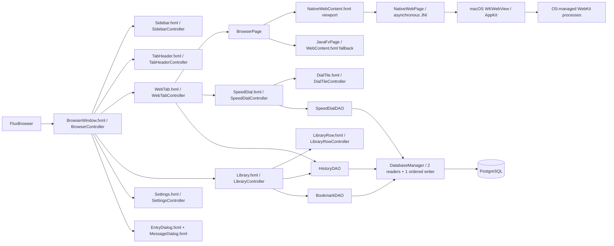

# Flux: architectural blueprint and MVP matrix

## 1. Min browser deconstruction

This analysis was completed against the supplied `../min` checkout before implementing Flux. The checkout identifies itself as Min 1.35.7 in `package.json`. It is an Electron application: `main/` manages native windows and web contents, `js/` coordinates the browser UI, `css/` styles it, `pages/` contains internal pages, and `ext/` contains larger browser subsystems. Flux uses these architectural ideas; it does not bundle Min or copy its implementation.

The browsing flow is `searchbar → urlParser.parse → browserUI → webviews → navigation/load/title events → tab state and places`. `js/browserUI.js` coordinates add, select, close, and popup actions. `js/tabState/tab.js` separates persistent tab attributes from transient loading/audio state. `js/navbar/navigationButtons.js` queries navigation availability when selection or location changes. `js/webviews.js` forwards page lifecycle events; `js/navbar/progressBar.js` presents loading state. `js/places/places.js` uses asynchronous messages to the places service, and `js/util/database.js` defines a Dexie/IndexedDB store that combines visited pages, bookmarks, tags, and search metadata.

| Capability | Evidence in the supplied Min source | Flux MVP decision |
| --- | --- | --- |
| Address versus search resolution | `js/util/urlParser.js`, `js/util/searchEngine.js` | Retain. Normalize HTTP(S), hostnames, local development addresses, and international domains; encode ordinary searches for DuckDuckGo. |
| Open, select, close tabs | `js/browserUI.js`, `js/tabState/tab.js`, `js/navbar/tabBar.js` | Retain. One controller per tab and a lazily created browser page; closing the last tab creates a fresh Speed Dial. |
| Back, forward, reload, stop | `js/navbar/navigationButtons.js`, `js/webviews.js`, `js/keybindings.js` | Retain through BrowserPage and native WebKit history and desktop keyboard shortcuts. Add a native FXML Home view. |
| Page title, progress, errors | `js/webviews.js`, `js/navbar/progressBar.js`, `pages/error/` | Retain real worker progress, title fallback, failed-load recovery, and cancellation. |
| Bookmarks and tags | `js/navbar/bookmarkStar.js`, `js/searchbar/bookmarkManager.js` | Retain a bookmark star and searchable library; replace tags with a single folder/category. |
| Browsing history | `js/places/places.js`, `js/places/placesService.js`, `js/searchbar/historyViewer.js` | Retain successful HTTP(S) visits in newest-first order, search, individual deletion, and clear-all. |
| New-tab page | `js/newTabPage.js`, `pages/newtab/` | Adapt to a custom FXML Speed Dial with editable persisted shortcuts. Min's source here handles a background image; the GX tiles are a Flux addition. |
| Popup/new-tab requests | `js/browserUI.js`, `main/viewManager.js` | Retain native WebKit popup routing to ordinary tabs. |
| Tasks, focus mode, session restore | `js/taskOverlay/`, `js/focusMode.js`, `js/sessionRestore.js` | Omit from this MVP. Tabs last for the current application session. |
| Ad/tracker filtering, HTTPS lists, phishing rules | `main/filtering.js`, `ext/`, `pages/phishing/` | Omit custom filtering/security engines. Use WebKit/JDK's normal networking and certificate checks. |
| Password managers and keychain integration | `js/passwordManager/`, `main/keychainService.js` | Omit credential vaults and autofill. |
| Full-text indexing, instant answers, plugins | `js/places/fullTextSearch.js`, `js/searchbar/` | Omit indexing and the plugin pipeline; SQL filters cover titles, URLs, and folders. |
| Reader, translation, PDF viewer, downloads | `reader/`, `pages/translateService/`, `pages/pdfViewer/`, `main/download.js` | Omit dedicated subsystems. This is a lightweight WebView browser, not a full Chromium replacement. |
| Electron IPC and process management | `main/main.js`, `main/viewManager.js` | Use a JavaFX shell, asynchronous JNI/AppKit integration, OS-managed WebKit helper processes on macOS, and bounded JDBC executors. JavaFX WebView remains the compatibility engine elsewhere. |

## 2. Component diagram



## 3. Package structure

```text
Flux/
├── pom.xml
├── database/schema.sql
├── config/database.properties.example
├── docs/
│   ├── ARCHITECTURE.md
│   ├── UI_SCENEBUILDER_GUIDE.md
│   └── PRESENTATION.md
├── src/main/java/com/flux/browser/
│   ├── FluxBrowser.java
│   ├── controller/          # One dedicated controller per FXML component
│   ├── db/                  # Connection manager and three concrete JDBC DAOs
│   ├── web/                 # BrowserPage, native bridge, compatibility engine
│   ├── model/               # Immutable records
│   └── util/                # URL resolution, FXML loading, owned dialogs
├── src/main/native/         # Objective-C JNI bridge and build script
├── src/main/resources/com/flux/browser/
│   ├── view/                # FXML screens, rows, chips, tiles, and dialogs
│   └── style.css
└── src/test/java/com/flux/browser/
    ├── BrowserChecks.java
    ├── DatabaseChecks.java
    ├── BrowserSmokeChecks.java
    └── PerformanceChecks.java
```

`src/main/java/module-info.java` declares the application module, its JavaFX/JDBC dependencies, and the controller package's reflective access for FXMLLoader. This also lets the JavaFX Maven plugin resolve `jdk.jsobject` transitively on modern JDKs.

## 4. Persistence and threading decisions

* PostgreSQL owns `history`, `bookmarks`, and `speed_dial`. The brief uses both `quick_dial` and `speed_dial`; **`speed_dial` is the single canonical table**, representing the same feature.
* Each history row is one successful HTTP(S) page-load visit. Reloads and Back/Forward loads count as visits; tab selection, Home, failed loads, cancelled loads, and title-only updates do not.
* Bookmarks and speed dials have unique URLs and editable titles. Bookmarks also have a category. Timestamps use `TIMESTAMPTZ`; Java stores `Instant` and formats dates in the machine's local time zone.
* The idempotent schema seeds the speed-dial table only when that table is first created. Deleted seed tiles stay deleted after a restart.
* All DAO methods return `CompletableFuture`. Two reader workers can run alongside one ordered writer. Schema initialization uses the writer; operations wait for its initialization future on worker threads. Each executor has a bounded 64-task queue, rejects excess work through the returned future, and retires idle workers after 30 seconds. No rejection policy moves SQL onto the caller's JavaFX thread.
* Every operation opens its own connection, marks reads read-only, and closes resources with try-with-resources. Configuration loading, schema work, connections, statements, and result iteration stay off JavaFX. No JDBC connection is shared between workers.
* UI callbacks re-enter the JavaFX Application Thread with `Platform.runLater`. Reads may see the last committed state while a write is pending, so controllers refresh after the write future completes. Writes remain ordered, including a history clear behind already queued visits. A new visit submitted after a clear is a new history entry.
* Database failure does not prevent browsing. A visible storage status, disabled persistence actions, starter shortcuts, and a Settings reconnect action explain the current state. Failed writes are reported; they are not silently buffered or represented as saved.
* Closing the window shuts down both executors without blocking JavaFX. Accepted writes drain; queued reads fail without opening a connection after shutdown, and already running reads finish. Connection, socket, and statement timeouts bound failed-network waits. A force-killed process cannot guarantee draining writes.

## 5. UI and engine decisions

All application-authored controls, including dynamic tab chips, list-row graphics, tile contents, dialogs, and the load-error panel, originate in FXML. Controllers load instances, bind state, and attach them to FXML-defined containers. Standard JavaFX control skins provide their usual internal rendering.

The shell uses the requested carbon palette (`#121214`, `#1c1c1f`, `#2c2c30`) with a magenta accent (`#fa1e4e`) and optional cyan (`#00ffff`). A narrow sidebar, custom tab chips, compact address strip, and uncluttered Speed Dial form the presentation view. SVGPath geometry inside FXML provides lightweight decorative artwork without image downloads or icon dependencies.

All 13 FXML/controller pairs preserve the shell layout separation. `WebTab.fxml` initially contains Home and the error overlay. First navigation creates a `BrowserPage`; macOS uses `NativeWebContent.fxml` as a viewport for WKWebView, and other platforms use `WebContent.fxml` with JavaFX WebView. Native page dialogs and file pickers belong to WebKit/AppKit. The user authorized this engine replacement after the original JavaFX-only brief.

`NativeWebPage` maintains FX-thread observable state. JNI commands enqueue on AppKit's main queue; navigation/KVO/script callbacks enqueue with `Platform.runLater`. UI dispatch never waits synchronously for a page-script result. AppKit and JavaFX share the macOS UI thread through Glass; website execution is handled by WebKit processes. WKWebView is a subview of the same window, sized in logical points from the FXML viewport after layout. Web pixels are not copied into a JavaFX texture. Bounds changes and native state notifications are coalesced; no permanent polling timer or extra Java rendering pool runs per tab.

Home pauses media and hides the native view while retaining history. Library/settings, inactive tabs, and minimized windows hide their view. Close removes KVO observations, delegates, the NSView, pending Java futures, and the tab registry entry. WebKit manages helper-process lifetime and background-page throttling. Popups return a WKWebView constructed with WebKit's supplied configuration, preserving opener relationships and POST navigation. Shell shortcuts route from native focus back to JavaFX; normal editing remains in WebKit. A terminated content process presents the normal retry screen.

WebKit's [multiprocess architecture](https://docs.webkit.org/Deep%20Dive/Architecture/WebKit2.html) handles web-content and networking outside the JavaFX shell. This is not a promise of one process per tab. On macOS 14+, a fixed Flux-specific website-data-store UUID provides persistent cookies/cache across tabs and launches; macOS 12–13 use the default persistent store. Native library compilation matches the JVM architecture. Maven supplies two JavaFX internal exports (`com.sun.javafx.stage`, `com.sun.javafx.tk`) solely to obtain the owning NSWindow handle; UI smoke checks must accompany JavaFX upgrades.

The Java heap starts at 64 MiB and is capped at 1 GiB, with WebKit/helper-process and GPU allocations additional. Blank tabs create no web content. Loaded pages retain documents and forms until closed, so there is no total-memory ceiling or automatic eviction. JDBC uses the bounded workers described above. On modern macOS, Metal renders the JavaFX shell; WKWebView independently uses the system compositor. The old synthetic software-renderer measurements are retained as historical evidence in [VERIFICATION.md](VERIFICATION.md), not as measurements of the new engine.

URL entry accepts HTTP(S) only, avoiding execution of address-bar `javascript:`/`data:` payloads and accidental external protocol launches. This does not replace the normal JavaScript execution of visited websites. The application does not expose Java objects to webpage JavaScript or disable certificate validation.

## 6. Dependency references

The Maven build targets Java 21 and pins OpenJFX 21.0.12 and PostgreSQL JDBC 42.7.13, checked against the [OpenJFX 21 release notes](https://gluonhq.com/products/javafx/openjfx-21-release-notes/) and [pgJDBC downloads](https://jdbc.postgresql.org/download/). JavaFX's Maven plugin selects native artifacts for the host platform; see the [official Maven setup](https://openjfx.io/openjfx-docs/#maven). The threading and page lifecycle design follows the [JavaFX web API](https://openjfx.io/javadoc/21/javafx.web/javafx/scene/web/package-summary.html).

Runtime verification exposed the old WebKit JavaScript bridge's incompatibility with the machine's JDK 26. The `modern-jdk` profile therefore selects OpenJFX 26.0.2 automatically on JDK 24+, while retaining the Java 21 source target. New JavaFX releases ship their own `jdk.jsobject` module; see the [official JavaFX 24 highlights](https://openjfx.io/highlights/24/) and [JavaFX 26 requirements](https://openjfx.io/highlights/26/).
