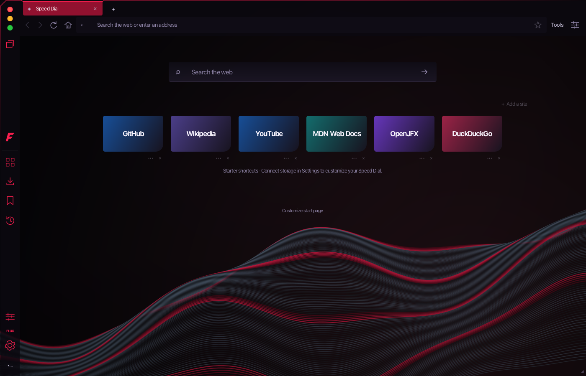
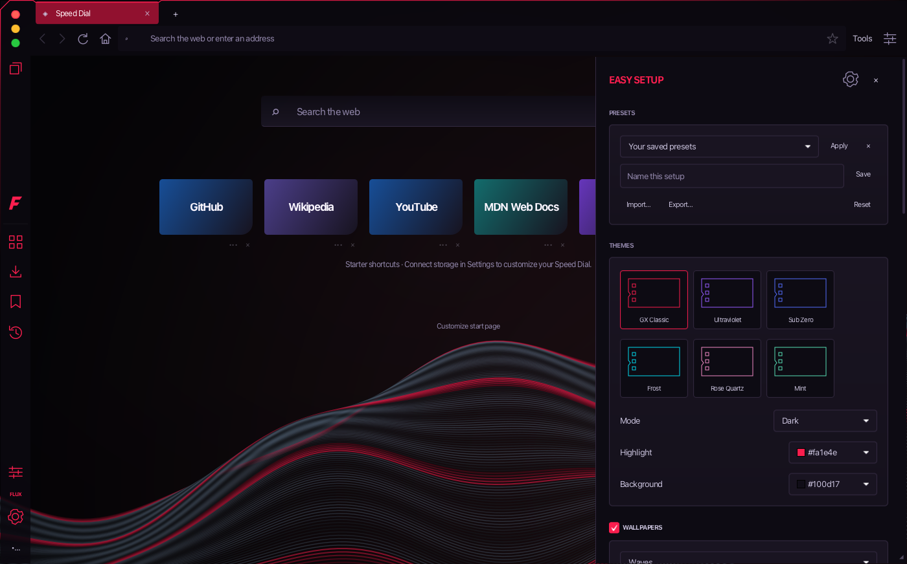
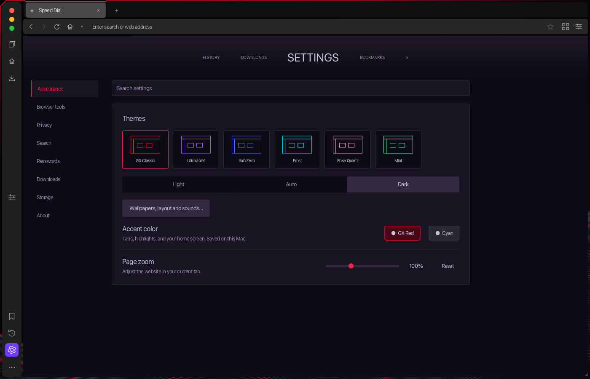
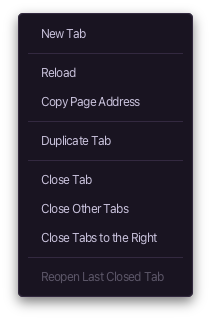
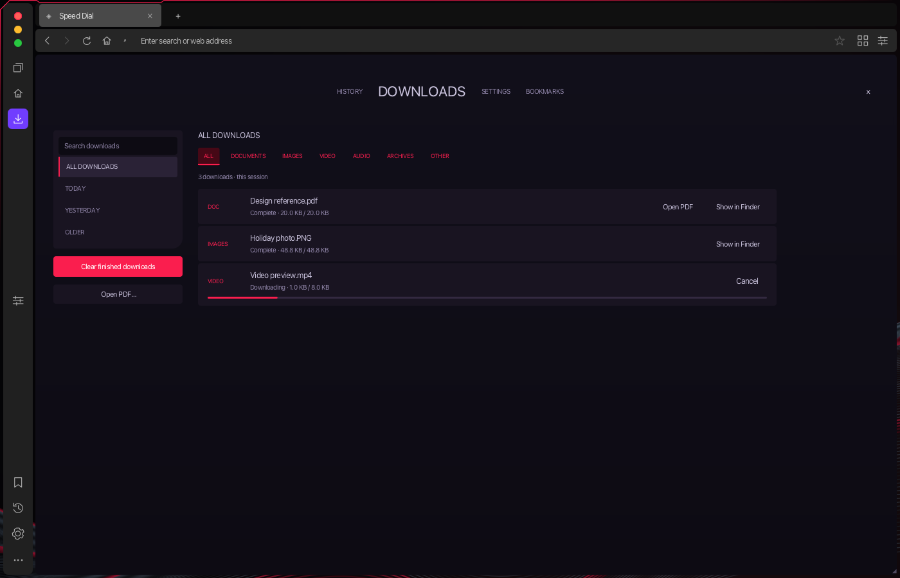
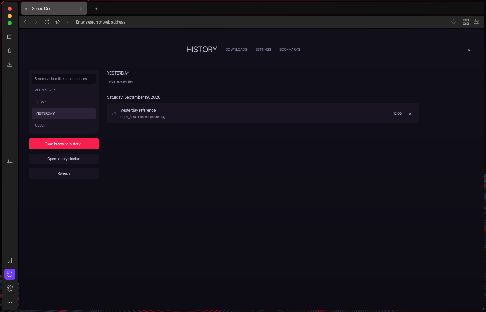

# Appearance and customization

Flux 1 keeps its GX-style Speed Dial, procedural wallpaper and Easy Setup controls. The toolbar and sidebar now follow the supplied [Figma reference](https://www.figma.com/design/DZBIqnVeyh0s7SL7huEfUG/Figma-basics?node-id=632-51&m=dev): charcoal surfaces, neutral tab selection, compact navigation buttons and purple sidebar selection. The reference contains raster screenshots; Flux reuses its existing vector controls and working actions. Opera AI is excluded.

Open **Easy Setup** using the sliders icon at the right of the address bar, the sidebar’s bottom button, or **Customize start page**. On Home it overlays the right side, as in the reference. On web pages it occupies a separate layout region: WKWebView resizes beside the controls and returns to its previous size when the panel closes. This avoids native content covering JavaFX controls. Escape closes the drawer.

## Available controls

| Group | Implemented behavior |
| --- | --- |
| Browser chrome | 46 px sidebar, vertical Mac window controls, compact neutral tabs, a new-tab button beside the tabs, a continuous charcoal address bar, a shared Reload/Stop position, and a blank Home address field. Resize from any outer edge/corner or the bottom-right grip; sizes respect usable display bounds. Maximize/restore keeps the page within the shell. Settings categories scroll on short windows. |
| Themes | GX Classic, Ultraviolet, Sub Zero, Frost, Rose Quartz and Mint color presets; custom highlight and background colors. |
| Light / Dark / Auto | Light and Dark apply immediately. Auto follows the public JavaFX system color-scheme preference where available, including the current JavaFX 26 Mac runtime. JavaFX 21 falls back to Dark for Auto. |
| Wallpapers | Original Waves, Aurora and Grid artwork, wallpaper on/off, brightness, blur and vignette. Local PNG/JPEG/GIF images can be selected; animated wallpaper playback is not implemented. |
| Interface | Compact, Comfortable and Spacious spacing; Home surface opacity; element backgrounds; installed font family and size. Wallpaper blur is a visual background effect, not macOS backdrop blur over a web page. |
| Speed Dial | Show/hide search, Speed Dial, tile titles and clock/date. Auto/Top/Center/Bottom positioning, larger tiles, three to eight maximum columns, and None/Zoom/Glow/Lift hover effects. Columns adapt to available width. Animations can be disabled. |
| Sidebar | Shortcut rail on/off. Workspaces stays below the window controls, with Home and downloads beneath it. Browser tools sits in the middle; bookmarks, history, settings and customization are anchored at the bottom. All controls open their existing functional destinations. Window controls stay available when shortcuts are hidden. |
| Status | Optional status/storage bar. Important short messages appear beneath the toolbar while that bar is hidden. |
| Audio | Optional original click and address-bar typing sounds; local background music with a volume control. Music pauses when the window is minimized. Sounds and music default to off. |
| Presets | Save, apply and remove up to 20 named appearance presets. Export/import the versioned Flux JSON format and reset to defaults. Imported/exported presets omit local media paths and do not activate background music. |

The default is dark GX Classic with Waves, charcoal browser chrome with purple selection, Comfortable content spacing, four maximum tile columns, hidden tile captions, and no audio. Theme highlight/background controls continue to customize the GX wallpaper, window contour and content panels; the toolbar and sidebar retain their neutral reference palette and adapt to Light/Dark/Auto mode. Stored Speed Dial entries remain yours; Opera’s sponsored shortcuts are not imported.

## Persistence and resources

Appearance and named presets are part of the existing atomic `session.json` in `~/Library/Application Support/Flux`. They restore even if tab restoration is disabled. Existing session files receive appearance defaults automatically. Writes use the same debounced session writer; no PostgreSQL schema changes are needed.

Preset files accept bounded data fields, not arbitrary CSS, scripts or remote asset URLs. Fonts are chosen from installed families. Wallpaper and music selection use native file choosers; images are limited to 32 MB and music files to 200 MB. Local media is referenced in place, so moving or deleting it requires choosing it again. An unavailable wallpaper falls back to procedural artwork.

The wallpaper redraws only after a size or appearance change, coalesced into a JavaFX pulse. It has no continuous animation loop. Custom image decoding uses background loading and a bounded requested image size. Only the active Home clock runs, and only when the clock is enabled. Hover transitions are short and optional. File operations run on one worker with a bounded queue. Native web rendering and video continue to use WKWebView.

## Differences from Opera GX

This implements the shared visual layout and a working Flux customization system; it is not complete pixel-for-pixel Opera GX parity. The following require separate assets, services or browser-engine work and have no placeholder controls:

- Opera AI, accounts, VPN, news/game feeds, sponsored suggestions and its online widget services.
- Opera’s mod marketplace and package runtime, shader/web-modding system, live video wallpapers and splash-screen mods.
- Opera’s Underwave font, branded artwork, third-party promotional tile graphics, proprietary sound packs and arbitrary icon replacement.
- Chromium-specific resource limiters, extensions and GPU effects. Flux’s existing native WebKit process management is retained.

The settings form controls use JavaFX skins, and web-page customization panels reflow native content instead of overlaying it. These are visible differences from the reference. Windows/Linux compatibility code remains in place for the next version.

## Verification

`AppearanceUiChecks` uses a temporary profile and a local HTTP page. It checks real FXML controls, theme application, presets, a 940 × 650 layout, native viewport reflow, persistence and relaunch with tab restoration disabled. Headless checks cover invalid colors/fonts/remote asset references, numeric bounds, old-session migration and preset persistence. Snapshots cover default Home, Easy Setup, Light mode and compact layout.

```sh
mvn -q -Pmodule-ui-check -Dflux.mainClass=com.flux.browser/com.flux.browser.AppearanceUiChecks test-compile javafx:run
```





Opera’s published [interface overview](https://blogs.opera.com/news/2024/11/opera-gx-now-lets-you-control-every-detail-of-your-browser-with-more-customization-options-than-ever-before/) supplemented the installed-app reference. The appearance implementation and procedural artwork are original Flux code.

## Shell polish

The [marked Figma spacing reference](https://www.figma.com/design/DZBIqnVeyh0s7SL7huEfUG/Figma-basics?node-id=640-74&m=dev) is implemented as a 4 px shell inset and 4 px gutters between the sidebar, tab strip, navigation bar and content. The sidebar surface is 46 px wide, with the 4 px gutter outside that width and 7 px inner padding around its 32 px buttons. This trims 1 px from each side of the 48 px cropped reference while preserving button size. Each chrome surface has rounded corners; the existing GX wallpaper remains visible through the gaps. The loading indicator sits at the navigation bar’s bottom edge without consuming the gap. Insets and margins are authored in FXML/CSS, so native page bounds follow the same layout when resizing.

The foreground accent uses a beveled upper-left corner, a fading vertical edge, and a shallow bend above the selected tab. The bend follows tab creation, selection, scrolling and resizing. It uses the selected accent color and redraws only when geometry or appearance changes; no continuous animation runs while idle.

Right-click a tab for New Tab, Reload, Copy Page Address, Duplicate, Close, Close Other Tabs, Close Tabs to the Right, and Reopen Last Closed Tab. Bulk closing is limited to the current workspace; Focus mode disables tab-changing actions. Right-click Speed Dial for adding a site, refreshing, Easy Setup or Settings. Shortcut menus offer opening, copying, editing and removing; unavailable storage actions are disabled. These shell menus share the current theme. Website menus keep WebKit’s link, media, selection and Inspect Element actions and add Search Selection in New Tab, Translate Page, Reader Mode and Save Page As. Translation offers a preferred language and explicit language choices; the result opens in a new tab.

Settings now has a category sidebar, search with empty-result feedback, theme previews, Light/Auto/Dark selection, zoom and storage controls. Other sections link to the existing browser tools. The **Workspaces** button sits directly below the window controls in the left rail and opens workspace management. It is also accessible from Browser tools. Settings uses a gear icon; Easy Setup uses sliders.





## Downloads, History and Speed Dial reference pages

The supplied PNG of Figma section `670:27` guides the internal managers: centered page navigation, a narrow left filter card, compact results and accent-colored controls. Downloads and History have full pages; Bookmarks shares the same library layout. Existing Settings remains accessible from their header.

- **Downloads:** search filenames/paths, filter All/Today/Yesterday/Older and file type, see live progress, cancel, reveal completed files in Finder or open completed PDFs. **Clear finished downloads** removes only completed/cancelled/failed list entries; it does not delete files or cancel active transfers. Entries remain session-only, with their initial timestamp retained across progress events.
- **History:** text search, local-day filters, dated groups, individual deletion and confirmed clear-all. Date ranges are applied in PostgreSQL before the 500-result cap. **Open history sidebar** shows the compact view alongside the current page; **Open full History view** returns to the manager. Escape closes the sidebar. Native content reflows beside it.
- **Speed Dial:** wider search and tiles, a plus tile in the grid, and a four-column default for new profiles. Existing saved column preferences remain in effect. The GX wallpaper, 46 px sidebar, button sizes and outer gaps are preserved.

Opera's gaming/news feed and sponsored tile content are not imported. The reference PNG is used for layout; all rows shown in tests are disposable fixtures. Managers use real Flux history/downloads in normal browsing.

`ManagerChecks` covers date/DST boundaries and download-state filtering. `ManagerUiChecks` uses a temporary profile, local HTTP fixture and an explicitly selected disposable `flux_test` database. It checks date filtering beyond 500 newer entries, search, file-type filters, live updates, clear-list semantics, compact layout, and History sidebar/native viewport restoration.

```sh
FLUX_TEST_DB_URL=jdbc:postgresql://127.0.0.1:55439/flux_test \
  mvn -q -Pmodule-ui-check -Dflux.mainClass=com.flux.browser/com.flux.browser.ManagerUiChecks test-compile javafx:run
```




