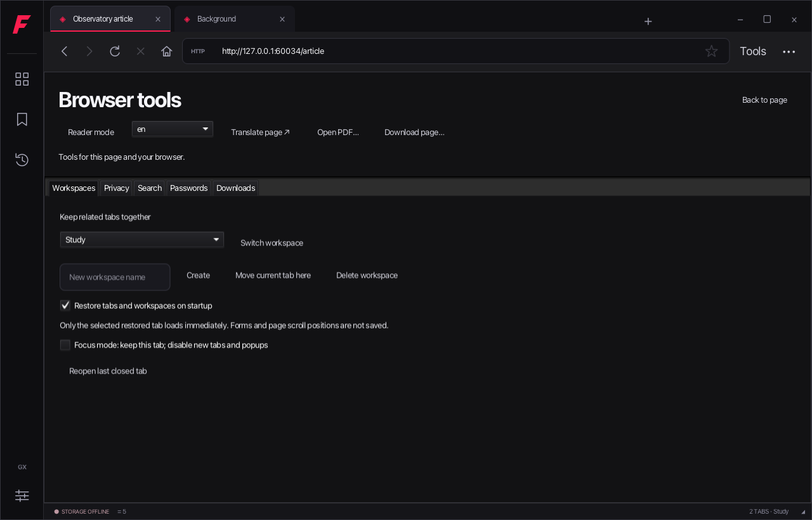
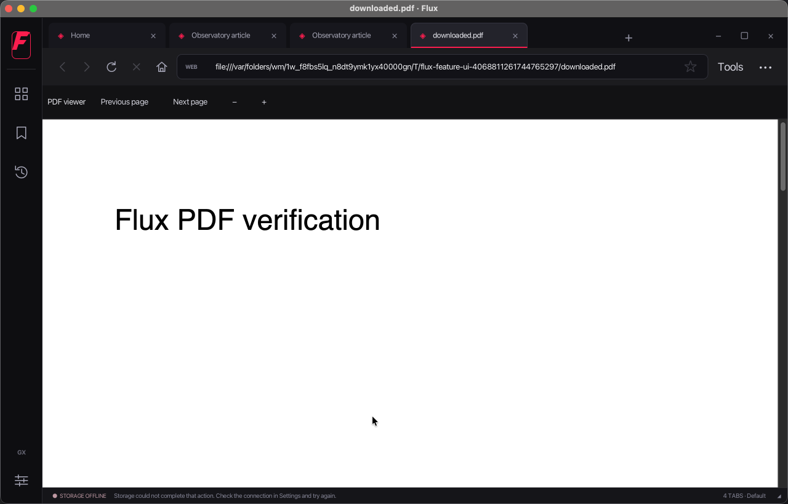

# Browser tools

**Version 1 is focused on macOS**, using the JavaFX shell and native WKWebView, Keychain, downloads and PDFKit. Windows/Linux support is planned for a later version. Existing compatibility code, resources and checks are preserved for that work.

Open **Browser tools** using the four-square icon beside the address bar to access browser features. Use the adjacent **Easy Setup** sliders icon for the GX-style themes, wallpapers, layout, fonts, sound controls and saved appearance presets. See [CUSTOMIZATION.md](CUSTOMIZATION.md) for the complete controls and differences from Opera GX.

| Feature | How it works / defaults |
| --- | --- |
| Appearance | Persistent color themes, Light/Dark/Auto, procedural or local wallpapers, opacity/blur/vignette, fonts, Speed Dial layout/effects, sidebar visibility, optional audio, and named/importable presets through Easy Setup. |
| Developer Tools | Tools → Developer Tools opens Apple’s Web Inspector for the current web tab in a separate window; F12 or Option+Cmd+I toggles it. Tools → Console or Option+Cmd+C opens its Console. Right-click a web page for Inspect Element. Browser controls remain visible during Inspector open/close and window resizing. Inspector windows belong to their source tabs and close with them. |
| Session restore | Enabled by default. Saves tab URL/title/zoom, workspace membership and selection. Only the selected restored tab loads; background tabs load when selected. Forms, navigation stacks and scroll positions are not saved. |
| Workspaces | Use the button directly below the window controls in the left rail. Create, switch, move the current tab or delete a workspace. Deleting moves its tabs to Default. At most 50 workspaces and 200 tabs. |
| Focus mode | Keeps the selected tab visible and prevents opening, closing or switching tabs/workspaces until disabled. Existing background tabs remain open. |
| Reopen tab | Restores the last closed tab's URL/zoom, up to 20 recent closures. Tools button or Cmd/Ctrl+Shift+T. |
| Domain blocking | Enabled by default with 11 starter domains. WebKit compiles rules, blocking matching third-party requests. Allow/block the current site, then reload. Optional Update blocklist imports up to 30,000 supported domain rules from AdGuard DNS Filter. No cosmetic rules or first-party ad filtering. |
| HTTPS upgrades | Enabled by default for hosts known by system WebKit, on newly opened tabs. This is not an HTTPS-only mode for every host. |
| Phishing warnings | Enables WebKit's system fraudulent-site warning service on newly opened tabs. Detection depends on macOS/service coverage. |
| Passwords | macOS Keychain default; explicit save/update, fill and delete by exact HTTPS origin and username. Flux-owned entries only. Optional installed Bitwarden/1Password CLI providers retrieve only the item ID you select. Never submits the form. |
| Full-text search | Off by default. Opt-in text indexing stores up to 200,000 characters per page and 1,000 pages in PostgreSQL. Password forms are excluded; other authenticated content may be stored. Search terms use PostgreSQL web-search syntax. Clearing history or the text index removes stored page text. |
| Instant answers | Local arithmetic such as `= (12 + 8) / 4`; result appears in the status bar. Supports decimal numbers, parentheses and + − * /. |
| Search plugins | Editable HTTPS URL templates containing `{query}`. Built-ins: `!gh`, `!w`, `!yt`. For example `!yt JavaFX tutorial`. Up to 50 templates; no downloaded extension code. |
| Reader | Right-click a webpage and choose **Reader Mode**. Readability extracts article text into a separate FXML window, with font size controls. Complex or non-article pages may not yield an article. |
| Translation | Right-click a webpage → **Translate Page** → choose a language or use your preferred language (saved under Browser tools → Search). Opens Google Translate with the current HTTP(S) page URL in a **new tab**. Requires internet; Google receives the page URL. Signed-in/dynamic pages may not translate fully through its proxy. |
| History | Full page with search, All/Today/Yesterday/Older filters and dated groups. An optional compact sidebar preserves the current page. Date filtering happens before the 500-result limit. Clear-all remains confirmed. |
| Downloads | Dedicated page with search, local-day and file-type filters, live rows and clear-finished-list action. WKDownload uses the current WebKit session. Choose a destination through macOS's save sheet; inspect progress, cancel or reveal in Finder. Downloads survive closing their source tab, but are cancelled on app exit and are not resumed across launches. No file is opened automatically. |
| PDF viewer | **Open PDF…** or the **Open PDF** action on a completed download opens a local PDF in a new tab. PDFKit supplies scrolling; FXML buttons navigate pages and zoom. HTTP(S) links inside PDFs open Flux tabs. Online PDFs may also display through WebKit; download them to use the dedicated local viewer. |

## Developer Tools

The native inspector loads on request, so ordinary browsing does not inject a developer-tools script into pages. It provides WebKit’s Elements, Console, Sources, Network, Timelines and Storage tools. Home and the PDFKit viewer have no web document to inspect.

macOS 13.3+ exposes inspection through the public `WKWebView.inspectable` API. Opening the inspector directly inside Flux and enabling Inspect Element use guarded WebKit private selectors; these may change with macOS updates. If local inspector controls are unavailable, use Safari’s Develop menu to inspect Flux on supported macOS versions. Enable Safari’s web developer features first. See [WebKit’s inspector setup](https://webkit.org/web-inspector/enabling-web-inspector/).

The JavaFX/Eruda compatibility work is retained for a future multi-OS release and is outside v1’s supported launch path.

## Password providers

In Tools → Passwords, the displayed page identifies where a login will be filled. For Keychain, supply a username and password, click **Save in Keychain**, then use **Fill selected login** on the matching HTTPS login page. A second save updates that origin/username entry. macOS may ask for Keychain access. Flux's service is `com.flux.browser.passwords`; values are not stored in PostgreSQL or the session file.

For Bitwarden or 1Password, install and unlock their official CLI separately. Flux looks for `bw` or `op` in `/opt/homebrew/bin` or `/usr/local/bin`. Supply the item ID rather than the username. Bitwarden requires an unlocked CLI session (`BW_SESSION` inherited by the launched browser). 1Password uses its configured CLI/desktop authorization. Save or edit external vault items in their own application. Fetches time out; output is bounded; passwords do not appear in command arguments or error messages. The selected item must contain a URL with the same HTTPS origin, including any non-default port.

## Storage and resources

Sessions/preferences live in `~/Library/Application Support/Flux/session.json` on macOS, written atomically with owner-only file permissions. The optional downloaded domain list is stored alongside it. Direct Java launches can override `flux.profileDir`; automated feature tests always select a temporary profile. Clearing browsing history preserves workspaces, bookmarks and Keychain entries. Disable **Restore tabs and workspaces** to start with a fresh tab while keeping preferences.

Session writes are debounced. Feature tasks use two workers with a bounded queue; JDBC retains two readers and one ordered writer. WebKit handles its own processes and video acceleration. Restored inactive tabs do not allocate a rendering engine until selected. Downloads and PDF buffers consume native memory outside the 1 GiB Java heap limit.

## Source references

- [WebKit content blockers](https://webkit.org/blog/3476/content-blockers-first-look/) and [domain targeting](https://webkit.org/blog/4062/targeting-domains-with-content-blockers/).
- [AdGuard DNS Filter source and licenses](https://github.com/AdguardTeam/AdGuardSDNSFilter); updating fetches its public `Filters/filter.txt` endpoint and imports supported plain domain rules.
- [Bitwarden CLI](https://bitwarden.com/help/cli/) and [1Password item commands](https://www.1password.dev/cli/reference/management-commands/item).
- [PDFKit link handling](https://developer.apple.com/documentation/pdfkit/pdfviewdelegate/pdfviewwillclick(onlink:with:)).

The expanded feature matrix is in [ARCHITECTURE.md](ARCHITECTURE.md); runtime evidence and untested cases are in [VERIFICATION.md](VERIFICATION.md).

### UI polish (macOS v1)

- Fading corner accent that bends above the selected tab.
- Themed tab, Speed Dial and shortcut context menus with functional actions and disabled states.
- Searchable Settings categories, direct theme previews and display-mode controls.
- Gear icon for Settings; Workspaces button directly below the left-side window controls.
- Native WebKit website menus retain their built-in actions and add translation, selected-text search, Reader mode and Save Page As. Developer inspection remains available.

### Where page actions live

Right-click a webpage for **Search Selection in New Tab**, **Translate Page**, **Reader Mode**, or **Save Page As…**. Search uses DuckDuckGo, opens a new tab and treats the selection as plain text even when it looks like a URL or an address-bar command. It is disabled without selected text. Translation opens Google Translate in a new tab. Save Page uses WebKit’s existing download flow and save dialog; it does not create a complete offline archive with all page assets.

Browser tools retains preferences and managers: workspaces, privacy, search providers, passwords and downloads. **Open PDF…** is on the Downloads page. Browser tools and Settings route to that page. JavaFX compatibility page controls are retained for the future cross-platform version and are hidden in the native macOS build.
