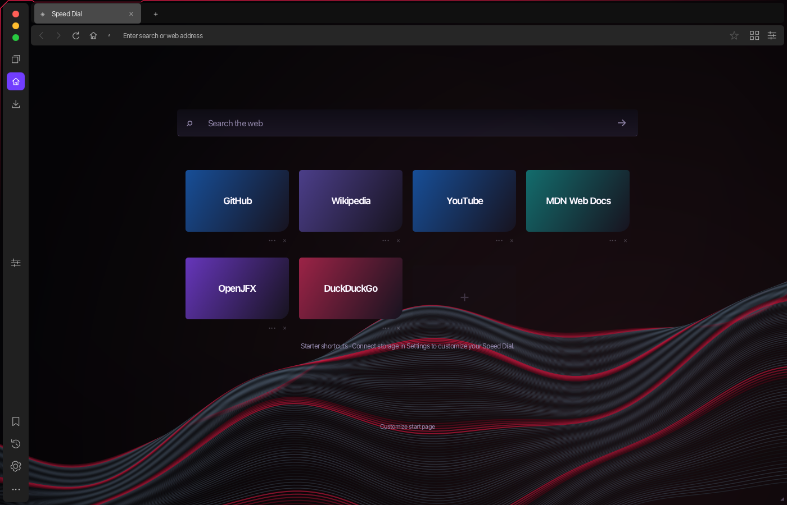

# Flux Browser

A JavaFX browser with an Opera GX-inspired dark theme, native WebKit rendering on macOS, and PostgreSQL persistence.

Built with Java 21, JavaFX, and WKWebView. Browsing works without a database — storage features activate when PostgreSQL is available.



## Prerequisites

- **JDK 21+** (Apple Silicon JDK recommended on M-series Macs)
- **Maven 3.9+**
- **Xcode Command Line Tools** — `xcode-select --install`
- **PostgreSQL** (optional, for bookmarks/history/speed dial persistence)

## Database Setup (Optional)

```sh
# Start PostgreSQL
brew services start postgresql@18

# Create the role and database
psql -d postgres
```

```sql
CREATE ROLE flux WITH LOGIN;
\password flux
CREATE DATABASE flux OWNER flux;
\q
```

```sh
# Copy and edit the config file with your password
cp config/database.properties.example config/database.properties
```

Tables are created automatically on first launch.

## Build & Run

```sh
mvn clean verify
mvn javafx:run
```

To open a specific URL at launch:

```sh
mvn javafx:run -Djavafx.args="--url=https://github.com/"
```

## Features

- **Native WebKit** — WKWebView for full web compatibility on macOS
- **Tabbed browsing** — independent tabs, popup handling, session restore
- **Navigation** — Back / Forward / Reload / Home / Stop, URL & search bar
- **Bookmarks & History** — toggle, edit, search (PostgreSQL)
- **Speed Dial** — editable start-page shortcuts
- **Workspaces** — organize tabs into groups
- **Ad/Tracker blocking** — domain-level blocking via Tools
- **Downloads & PDF viewer** — built-in download manager and PDFKit viewer
- **Reader mode & Translation** — distraction-free reading, translate in new tab
- **Focus mode** — minimize distractions
- **HTTPS upgrades & Phishing warnings** — security defaults
- **Password providers** — optional macOS Keychain, Bitwarden, or 1Password CLI
- **GX-inspired theming** — accent colors, wallpapers, fonts, sound, and presets via Easy Setup
- **Developer Tools** — F12 or Option+Cmd+I
- **Zoom** — per-tab zoom level

## Keyboard Shortcuts

| Action | Shortcut |
| --- | --- |
| Focus address bar | Cmd+L |
| New / Close tab | Cmd+T / Cmd+W |
| Next / Previous tab | Ctrl+Tab / Ctrl+Shift+Tab |
| Select tab 1–8 / last | Cmd+1–8 / Cmd+9 |
| Back / Forward / Home | Alt+Left / Alt+Right / Alt+Home |
| Reload | Cmd+R or F5 |
| Toggle bookmark | Cmd+D |
| History / Bookmarks | Cmd+Y / Cmd+Shift+B |
| Developer Tools | F12 or Option+Cmd+I |

## Project Structure

```
├── src/main/java/       # Application source
├── src/main/native/     # WKWebView bridge (Objective-C)
├── src/main/resources/  # FXML views, CSS, assets
├── src/test/            # Tests and verification checks
├── config/              # Database config (gitignored)
├── database/            # SQL schema
├── docs/                # Architecture, features, verification docs
└── pom.xml              # Maven build config
```

## Documentation

- [Architecture](docs/ARCHITECTURE.md)
- [Features Guide](docs/FEATURES.md)
- [Customization](docs/CUSTOMIZATION.md)
- [Verification Results](docs/VERIFICATION.md)
- [UI & Scene Builder Guide](docs/UI_SCENEBUILDER_GUIDE.md)
- [Presentation Guide](docs/PRESENTATION.md)
- [Third-Party Notices](docs/THIRD_PARTY_NOTICES.md)

## Dependencies

| Dependency | Version | Purpose |
| --- | --- | --- |
| JavaFX Controls + FXML + Web | 21.0.12 | UI framework |
| Gson | 2.13.2 | JSON for settings and search providers |
| PostgreSQL JDBC | 42.7.13 | Database storage |

On JDK 24+, JavaFX 26.0.2 is selected automatically.
